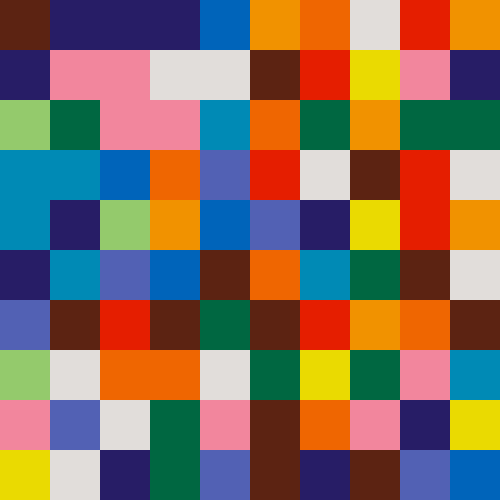

# ellsworth

A small program to generate an image in the style of
[Ellsworth Kelly](https://www.sfmoma.org/artwork/99.352), inspired by [Jenn
Schiffer](http://jennmoney.biz/)'s [`var t;`](http://vart.institute/).

This was mostly just a fun exercise for learning a bit more Rust.

For a much simpler JavaScript implementation, see the [index.html](https://htmlpreview.github.io/?https://github.com/mxhold/ellsworth/blob/master/index.html) file.

## Getting started

Requires [Rust](https://rust-lang.org).

Pull down the project:

    git clone git@github.com:mxhold/ellsworth.git
    cd ellsworth

Add a file `colors.csv` with the following format:

    name,red,green,blue
    brown,92,35,18
    blue,82,97,180
    orange,239,102,1
    skyblue,0,138,181
    green,0,103,65
    yellow,234,218,1
    pink,242,134,157
    middleblue,0,100,186
    lightorange,241,146,0
    red,229,30,0
    lightgreen,148,202,108
    purple,39,29,102
    grey,225,221,218

Then to generate an image with 500x500 pixels and 10x10 tiles at `image.png`:

    cargo build --release
    ./target/release/ellsworth 500 10

Example image:

